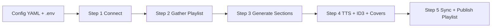

# AI Radio

AI Radio is a tool that uses AI to convert your Music Assistant playlists to a radio station.

This project takes a source playlist, injects AI-generated moderator sections (intros, transitions, weather, news, fun bits), converts them to speech, and publishes a fresh target playlist in Music Assistant.

## Features

- 5-step pipeline with clear boundaries and debug output
- Music Assistant integration via `music-assistant-client` SDK
- Rule-based section scheduling (`MUST`, `ALTERNATIVE`, `OPTIONAL` + guards)
- Dynamic generation mode with live queue updates (`--dynamic-generation`)
- Optional weather context (Open-Meteo)
- Optional news context with OpenAI web search
- OpenAI or ElevenLabs TTS generation for all sections
- Optional cover image generation per section (OpenAI Images)
- ID3 metadata writing for generated MP3 files
  - human-readable title from `sections[*].name`
  - artist set to `AI Radio`
  - cover artwork embedding when configured
- Auto-create target playlist with date + run id
- OpenAI cost check mode in step 5 (`--only-oai-check`)

## How It Works

1. `step1_connect.py`
Connect to Music Assistant and verify access.

2. `step2_gather_playlist.py`
Load source playlist + tracks (optional random subset by `max_duration`).

3. `step3_generate_sections.py`
Evaluate `section_order`, resolve placeholders, fetch optional context, generate section text.

4. `step4_tts_sections.py`
Convert text to MP3, set metadata, embed covers.

5. `step5_update_playlist.py`
Sync section provider, create target playlist, add tracks + generated sections.

`main.py` orchestrates all steps.

## Architecture



## Project Structure

- `main.py`: pipeline orchestrator
- `step1_connect.py` ... `step5_update_playlist.py`: pipeline steps
- `step_generate_covers.py`: one-shot section cover generation
- `dynamic_daemon.py`: HTTP daemon to start/stop dynamic generation runs
- `lib/`: shared modules (`ma_client`, providers, helpers)
- `config/sample_config.yaml`: fully documented reference config
- `deploy/ai-radio-dynamic-daemon.service`: systemd unit for daemon deployment
- `.tmp/`: runtime artifacts (ignored by git)

## Requirements

- Python 3.12+
- A Music Assistant instance with API access
- OpenAI API key for LLM (and optional images/news search)
- TTS API key for selected provider (`OPENAI_API_KEY` or `ELEVENLABS_API_KEY`)

## Setup

1. Create and activate virtual environment

```bash
python3 -m venv .venv
source .venv/bin/activate
pip install -r requirements.txt
```

2. Create `.env` in repository root

```bash
OPENAI_API_KEY=...
OPENAI_ADMIN_KEY=...            # optional (cost endpoint)
ELEVENLABS_API_KEY=...          # optional (only if TTS provider is ElevenLabs)
MUSIC_ASSISTANT_API_KEY=...
```

3. Create local config

```bash
cp config/sample_config.yaml config/local_config.yaml
```

4. Edit `config/local_config.yaml`

- set Music Assistant `base_url`
- set source `playlist_id`
- set local `section_store_path`
- set provider ids/domains for your MA setup

5. Ensure Music Assistant can read generated section files

- MA must have filesystem access to `general.section_store_path` (or the same share/path exposed by your MA filesystem provider).
- Recommended: run this pipeline on the same host as MA, or use a shared SMB/NFS path mounted on both systems.
- Why: step 5 triggers MA sync, then searches MA library for indexed section tracks and adds them by URI (not by your local host file path).

## Usage

Run full pipeline:

```bash
python3 main.py -c config/local_config.yaml
```

Run from a specific step:

```bash
python3 main.py -c config/local_config.yaml --from-step 3
```

Generate covers only:

```bash
python3 main.py -c config/local_config.yaml --generate-covers-only
```

Step 5 billing check only:

```bash
python3 step5_update_playlist.py -c config/local_config.yaml --only-oai-check
```

Dynamic generation mode (no target playlist creation, queue playback directly):

```bash
python3 main.py -c config/non_techno_playlist.yml --dynamic-generation 1 --playback-device ap8aedae8231f2
```

Dynamic daemon (HTTP start/stop for dynamic mode):

```bash
python3 dynamic_daemon.py --port 8787 --auth-token YOUR_TOKEN
```

Start dynamic generation:

```bash
curl -H "Authorization: Bearer YOUR_TOKEN" \
  "http://127.0.0.1:8787/start-dynamic?playback-id=ap8aedae8231f2&generate_count=1&config=config/non_techno_playlist.yml"
```

Stop current dynamic run:

```bash
curl -H "Authorization: Bearer YOUR_TOKEN" \
  "http://127.0.0.1:8787/stop-dynamic"
```

Systemd service file is included at `deploy/ai-radio-dynamic-daemon.service`.

Install service (Linux/systemd):

```bash
sudo cp deploy/ai-radio-dynamic-daemon.service /etc/systemd/system/ai-radio-dynamic-daemon.service
sudo systemctl daemon-reload
sudo systemctl enable --now ai-radio-dynamic-daemon.service
sudo systemctl status ai-radio-dynamic-daemon.service
```

`DYNAMIC_DAEMON_TOKEN` can be provided via `.env` or `.env.dynamic-daemon`.

## Configuration Guide

All options are documented in `config/sample_config.yaml`.

Important groups:

- `general`: naming, timezone, host style prompt, output paths
- `providers`: credentials + provider-specific behavior
- `sections`: generated content blocks (`ai_text`) and optional merger (`ai_meta`)
- `section_order`: placement rules and guard constraints

## Covers and Metadata

Per section, you can define:

- `name`: human-readable metadata title base
- `cover_image`: image filename located in `general.covers_path`

For the target playlist, you can define:

- `general.playlist_cover_image`: playlist cover image (filename, absolute path, or URL)

For merged multi-section outputs (`multi_*`), the system falls back to the `ai_meta` section cover/name when available.

## Output Naming

Target playlist:

- `AI Radio: <general.name> (<weekday>. <dd.mm.>) [<run_id>]`

Generated section track metadata:

- title: `<sections[*].name> [<run_id>]`
- artist: `AI Radio`

## Notes

- `.env` is loaded automatically from repository root.
- Runtime artifacts are written to `.tmp/`.
- If a section cover is missing, MP3 generation still succeeds.
